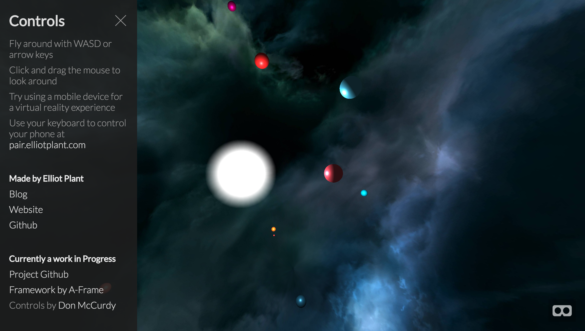

# Celestial Dance

A virtual reality, interactive, celestial body simulation
Compatible with Google cardboard!

1. Open [celestial.elliotplant.com](celestial.elliotplant.com) on your phone
2. Open [pair.elliotplant.com](pair.elliotplant.com) on your computer to
3. Enter the pair code from your phone into the pair-code field on your computers
4. Enter VR mode on your phone by clicking the button in the bottom right corner
5. Put your phone in your headset
6. Fly around space with your arrow keys!




Celestial Dance was built with [A-Frame VR](https://aframe.io/), [three.js](http://threejs.org/), [React](https://facebook.github.io/react/), and [Express](https://expressjs.com/).

## Requirements

- npm [install here](http://blog.npmjs.org/post/85484771375/how-to-install-npm)
- docker [install here](https://docs.docker.com/engine/installation/)

## Setup server

This project is setup to be developed and run either locally, or on a local or deployed docker-machine. Running the app via Docker will ensure a consistent environment across computers and is therefore recommended.

#### Docker

Docker provides a means of packaging applications and their relevant dependencies into blank Linux 'containers' to ensure consistency between development and production environments.

'Dockerfile' provides instructions for how to build the app image and install dependencies

Use the following instructions to run the Wiki Museum server via docker:

__Step 1: Install Docker__

If you don't have it already, you will need to install the [Docker toolbox](https://docs.docker.com/engine/installation/mac/). This will enable you to setup Docker machines, build Docker images, and compose containers.

__Step 2: Select docker-machine__


```
$ docker-machine ls
```

The machine marked with an asterix is currently active. To select a docker-machine, run

```
$ eval $(docker-machine env [name of docker-machine]))
```

__Step 3: Build Docker image__

The Dockerfile provides instructions on how to build the docker image (and ultimately run the container). Run the following in the command line to build the image

```
$ npm run build
```

__Step 4: Run Docker container__

Running the container will execute the command in the CMD line of the Dockerfile. To run the container based on the newly-built images, run the following:

```
$ npm run deploy
```

To see running containers on your docker-machine:

```
$ docker ps
```

Use the '-a' flag to view all containers, as opposed to just those which are running.

To see the most recent logs from a container process, run

```
$ docker logs [container ID]
```

__Step 5: Remove container and image to rebuild__

If you make changes to the server code, you will need to destroy the existing Thumbroll container and image to allow Docker to rebuild. The postgres container and image do not need to be removed.

To see all containers on the docker-machine:

```
$ docker ps -a
```

To force stop and delete a container:

```
$ docker rm -f [container id]
```

To see all images on the docker-machine:

```
$ docker images
```

To remove an image:

```
$ docker rmi [imageID]
```

#### Local

Instead of running the server within Docker containers, the server may also be run locally.

__Step 1: Install dependencies__

```
$ npm install
```

__Step 2: Install Webpack__

```
$ npm install -g webpack
```

__Step 3: Run server__

```
$ npm start
```
